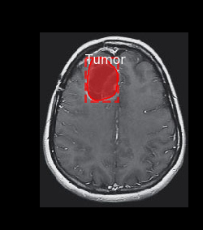

# Brain Tumor Segmentation
[](https://fairscale.readthedocs.io/en/latest/?badge=latest) [](https://github.com/facebookresearch/fairscale/blob/master/CONTRIBUTING.md)


A cancerous or non-cancerous mass or growth of abnormal cells in the brain. Tumours can start in the brain, or cancer elsewhere in the body can spread to the brain.This repository provides source code for a deep convolutional neural network architecture 
designed for brain tumor segmentation.The architecture is fully convolutional network (FCN) built upon the well-known U-net model and it makes use of residual units instead of plain units to speedup training and convergence.
The implementation is based on pyTorch .



## Dataset 
Dataset used in: Mateusz Buda, AshirbaniSaha, Maciej A. Mazurowski "Association of genomic subtypes of lower-grade gliomas with shape features automatically extracted by 
a deep learning algorithm." Computers in Biology and Medicine, 2019.

This dataset contains brain MR images together with manual FLAIR abnormality segmentation masks. The images were obtained from The Cancer Imaging Archive (TCIA). They correspond 
to 110 patients included in The Cancer Genome Atlas (TCGA) lower-grade glioma collection with at least fluid-attenuated inversion recovery (FLAIR) sequence and genomic cluster data available.


## Introduction

#### Directory Layout 
    .
    ├── data                                                            # data folder is hidden , path is provided in .gitnore file
    │   ├── data.csv
    ├── src
    │   ├── config.py                                                   # contains all the configuration
    |   ├── data_load.py                                                # loading dataset
    |   ├── dataset_class.py                                            # creating dataset
    |   ├── dice_loss.py                                                # creating loss function
    |   ├── plot_everything.py                                          # plotting dataset
    |   ├── predict.py                                                  # End-to-end, prediction file
    |   ├── test.py                                                     # testing model 
    |   ├── train.py                                                    # training model 
    |   ├── unet_arch                                                   # creating UNet Architecture
    ├── static
    |   ├── inputImage.jpg                                              # input image
    ├── templates
    |   ├── btindex.html                                                # html file for the UI
    ├── weights
    |   ├── model.h5                                                    # trained weights
    ├── brainapp.py                                                     # web app file
    
#### Content
| Directory | Info |
|-----------|--------------|
| `notesbook` | contains jupyter notebook related to `EDA` and `experiment` | 
| `src` | Contains all Python files |
| `templates` | Contains HTML file |
| `static` | Contains css, js files and images  |
| `data` | Contains [data](https://www.kaggle.com/mateuszbuda/lgg-mri-segmentation) which is hidden  |
| `weights` | contains trained weights |

## Evaluation 
The proposed approach was evaluated using Precision , Recall , Accuracy and F1 Score. Our source code is freely available here.


## Prerequisites
* Python 3.4+
* PyTorch and its dependencies

## How to Install and Run
* Clone this repository and run in command prompt
```bash
pip install -r requirement.txt
``` 
* Run this to start server
```bash
python brainapp.py
``` 
* Update `MR` Image and predict if user has `brain tumor` or not and if yes then `where` 


## Train your own model*
* you can change configuration from config.py

> Note :

> `*` :- 
