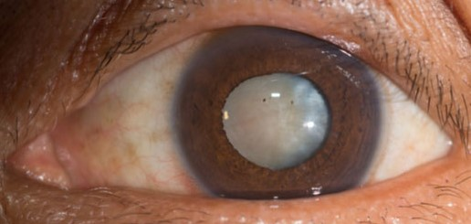
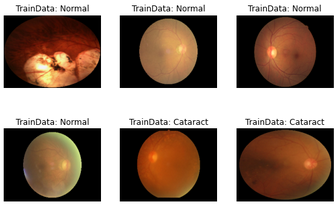
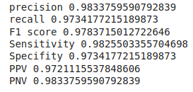

# Cataract Detection
[](https://fairscale.readthedocs.io/en/latest/?badge=latest) [](https://github.com/facebookresearch/fairscale/blob/master/CONTRIBUTING.md)

A cataract is an opacification of the lens of the eye which leads to a decrease in vision. Cataracts often develop slowly and can affect one or both eyes.When a cataract 
interferes with someone's usual activities, the cloudy lens can be replaced with a clear, artificial lens.



## Dataset 
Ocular Disease Intelligent Recognition (ODIR) is a structured ophthalmic database of 5,000 patients with age, color fundus photographs from left and right eyes and doctors' diagnostic keywords from doctors.

This dataset is meant to represent ‘‘real-life’’ set of patient information collected by Shanggong Medical Technology Co., Ltd. from different hospitals/medical centers in China.



## Introduction

#### Directory Layout 
    .
    ├── data                                                            # data folder is hidden , path is provided in .gitnore file
    │   ├── Images_folder
    |   |── data.csv
    ├── src
    │   ├── config.py                                                   # contains all the configuration
    |   ├── dataset_class.py                                            # create dataset
    |   ├── predict.py                                                  # End-to-end, prediction file
    |   ├── preprocess.py                                               # pre process dataset
    |   ├── train.py                                                    # training model 
    ├── static
    |   ├── inputImage.jpg                                              # input image
    ├── templates
    |   ├── catindex.html                                               # html file for the UI
    ├── weights
    |   ├── cat.h5                                                      # trained weights
    |   ├── cat1.h5                                                     # trained weights
    ├── catapp.py                                                       # web app file
    
#### Content
| Directory | Info |
|-----------|--------------|
| `src` | Contains all Python files |
| `templates` | Contains HTML file |
| `static` | Contains css, js files and images  |
| `data` | Contains [data](https://www.kaggle.com/andrewmvd/ocular-disease-recognition-odir5k) which is hidden  |
| `weights` | contains trained weights |

## Evaluation 
The proposed approach was evaluated using Precision , Recall , Accuracy and F1 Score. Our source code is freely available here.



## Prerequisites
* Python 3.4+
* PyTorch and its dependencies

## How to Install and Run
* Clone this repository and run in command prompt
```bash
pip install -r requirement.txt
``` 
* Run this to start server
```bash
python catapp.py
``` 
* Update `Retina` image and predict if user has `cataract` or not


## Train your own model*
* For traning you need to run `train.py` in src directory.
* if want to change epochs, data directory, random seed, learning rate, etc change it from `config.py`.

> Note :
> *:- This project purely utilize pytorch, it would be appriciated to use pytorch only.

