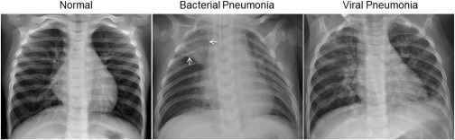

# Pneumonia Detection
[](https://fairscale.readthedocs.io/en/latest/?badge=latest) [](https://github.com/facebookresearch/fairscale/blob/master/CONTRIBUTING.md)

<!--
[![Contributors][https://img.shields.io/github/contributors/manpreet2000/Medical-AI.svg?style=flat-square]][https://github.com/manpreet2000/Medical-AI/graphs/contributors]
[![Forks][https://img.shields.io/github/forks/manpreet2000/Medical-AI.svg?style=flat-square]][https://github.com/manpreet2000/Medical-AI/network/members]
[![Stargazers][https://img.shields.io/github/stars/manpreet2000/Medical-AI.svg?style=flat-square]][https://github.com/manpreet2000/Medical-AI/stargazers]
[![Issues][https://img.shields.io/github/issues/manpreet2000/Medical-AI.svg?style=flat-square]](https://github.com/manpreet2000/Medical-AI/issues)
 -->
Pneumonia is the leading cause of death among young children and one of the top mortality causes worldwide. The pneumonia detection is usually performed through examine of chest X-Ray radiograph by highly trained specialists. This process is tedious and often leads to a disagreement between radiologists. Computer-aided diagnosis systems showed potential for improving the diagnostic accuracy. In this work, we develop the computational approach for pneumonia regions detection based on single-shot detectors, squeeze-and-extinction deep convolution neural networks and augmentations. 


## Dataset 
The dataset is organized into 3 folders (train, test, val) and contains subfolders for each image category (Pneumonia/Normal). There are 5,863 X-Ray images (JPEG) and 2 categories (Pneumonia/Normal).

The normal chest X-ray (left panel) depicts clear lungs without any areas of abnormal opacification in the image. Bacterial pneumonia (middle) typically exhibits a focal lobar consolidation, in this case in the right upper lobe (white arrows), whereas viral pneumonia (right) manifests with a more diffuse ‘‘interstitial’’ pattern in both lungs.



## Introduction

#### Directory Layout 4
    .
    ├── data                                                            # data folder is hidden , path is provided in .gitnore file
    │   ├── test
    │   │   ├── NORMAL
    │   │   ├── PNEUMONIA
    │   ├── train
    │   │   ├── NORMAL
    │   │   ├── PNEUMONIA
    │   ├── val
    │   │   ├── NORMAL
    │   │   ├── PNEUMONIA
    ├── notebook
    │   ├── x-ray-image-classification-using-pytorch.ipynb              # notebooks related to `EDA` and `experiment`
    ├── src
    │   ├── config.py                                                   # contains all the configuration
    |   ├── plot_me.py                                                  # program file for visualisation of dataset 
    |   ├── predict.py                                                  # End-to-end, prediction file
    |   ├── train.py                                                    # training model 
    ├── static
    |   ├── inputImage.jpg                                              # input image
    ├── templates
    |   ├── pneindex.html                                               # html file for the UI
    ├── weights
    |   ├── pne.pt                                                      # trained weights
    ├── pneapp.py                                                       # web app file


#### Content
| Directory | Info |
|-----------|--------------|
| `notebooks` | Contains all jupyter notebooks related to `EDA` and `experiment` |
| `src` | Contains all Python files |
| `templates` | Contains HTML file |
| `static` | Contains css, js files and images  |
| `data` | Contains [data](https://www.kaggle.com/paultimothymooney/chest-xray-pneumonia) which is hidden  |

## Evaluation 
The proposed approach was evaluated using Precision , Recall , Accuracy and F1 Score. Our source code is freely available here.


## Prerequisites
* Python 3.4+
* PyTorch and its dependencies

## How to Install and Run
* Clone this repository and run in command prompt
```bash
pip install -r requirement.txt
``` 
* Run this to start server
```bash
python pneapp.py
``` 
* Update `X-Ray` image and predict if user has `pnemonia` or not


## Training your own model*
* you can change configuration from config.py

> Note :
> * :- 


